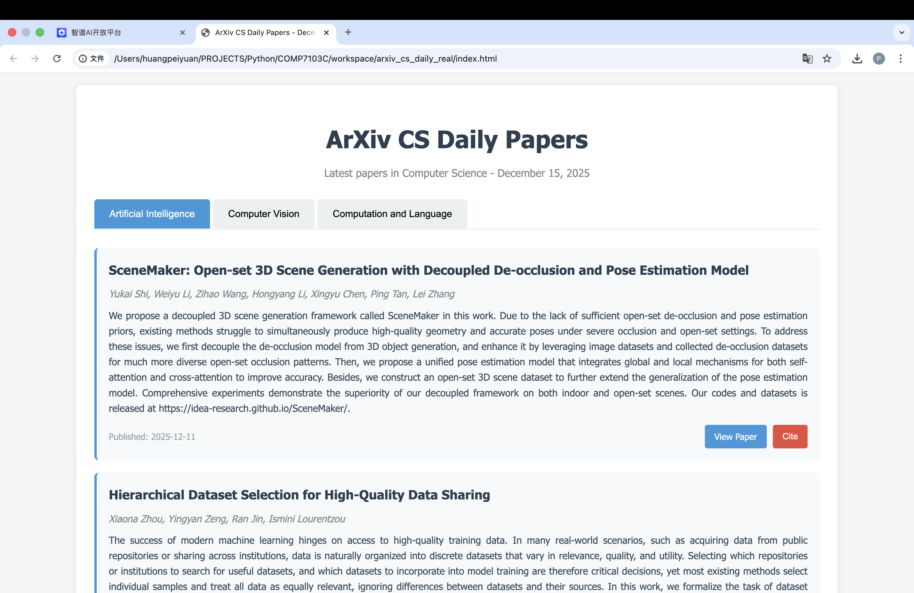
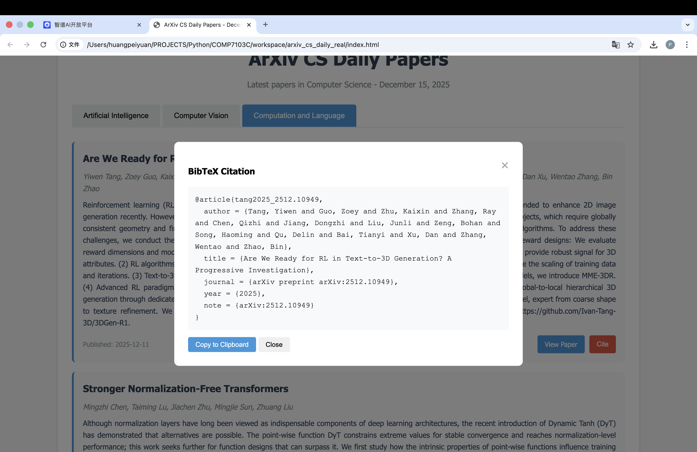

# MiniTeam: Autonomous AI Software Squad

**MiniTeam** is a Multi-Agent System capable of autonomously planning, coding, testing, and documenting complex software projects.

> **Universal Compatibility**: MiniTeam is built on the standard `OpenAI` client, making it compatible with **ANY** API provider that supports the OpenAI format (e.g., **DeepSeek**, **OpenAI**, **Z.AI**, or local **vLLM**).

## The Team Structure

MiniTeam is not just a chatbot; it is a hierarchical team of 5 specialized agents working in unison:

1.  **Manager (Architect)**:
    *   **Role**: Project Lead & Strategist.
    *   **Responsibilities**: Analyzes user Requests, breaks them down into sub-tasks (Chain of Thought), and delegates work to specialists.
    *   **Motto**: "Think twice, code once."

2.  **Frontend Developer**:
    *   **Role**: UI/UX Specialist.
    *   **Expertise**: HTML5, Modern CSS (Flex/Grid), JavaScript, Responsive Design.

3.  **Backend Developer**:
    *   **Role**: Logic & Data Specialist.
    *   **Expertise**: Python (Flask/FastAPI), APIs, Data Structures, File I/O.

4.  **QA Engineer**:
    *   **Role**: Quality Assurance.
    *   **Responsibilities**: Writes and runs test scripts (`pyunit`, `pytest`), verifies output, and ensures requirements are met.

5.  **Technical Writer**:
    *   **Role**: Documentation Specialist.
    *   **Responsibilities**: Writes `README.md` files, API documentation, and usage guides.

---

## Getting Started

### Prerequisites
- Python 3.8+
- An API Key from **any OpenAI-compatible provider** (e.g., DeepSeek, OpenAI, ZhipuAI).

### Installation

1.  **Clone the repository**:
    ```bash
    git clone https://github.com/ProphetNg/MiniTeam.git
    cd MiniTeam
    ```

2.  **Set up Virtual Environment**:
    ```bash
    python3 -m venv mini_agent/venv
    source mini_agent/venv/bin/activate
    pip install -r mini_agent/requirements.txt
    ```

3.  **Configure Environment**:
    Create a `.env` file in `mini_agent/`. You can use any provider details here:
    
    ```ini
    OPENAI_API_KEY=your_api_key
    OPENAI_BASE_URL=https://open.bigmodel.cn/api/paas/v4
    OPENAI_MODEL=GLM-4.5
    ```

## Usage

Start the interactive CLI:

```bash
mini_agent/venv/bin/python mini_agent/main.py
```

### Demo Mode (Automated Case Study)

To see the MiniTeam build the "arXiv CS Daily" project completely autonomously (without user input):

```bash
mini_agent/venv/bin/python mini_agent/verify_arxiv.py
```

This script will:
1.  Initialize the **Manager Agent**.
2.  Send a complex prompt to build a web scraper and frontend.
3.  Automatically delegate tasks to **Backend**, **Frontend**, and **QA** agents.
4.  Generate the full result in `workspace/arxiv_cs_daily_real`.

### Example Prompts
*   "Build a Tic-Tac-Toe game with a Python backend and HTML frontend."
*   "Create a script to fetch the latest CS papers from arXiv and generate a website."
*   "Make a personal landing page with a dark mode toggle."

The **Manager** will take it from there, coordinating the team to build your project in the `workspace/` directory.

---

## Directory Structure

```text
.
├── mini_agent/
│   ├── main.py        # CLI Entry Point
│   ├── team.py        # Manager Agent Logic
│   ├── workers.py     # Specialist Agents (Frontend, Backend, etc.)
│   ├── agent.py       # Base Agent Class
│   └── tools.py       # File I/O & Shell Tools
├── workspace/         # All generated projects are saved here
└── README.md          # You are here
```

---

## Case Study: arXiv CS Daily

We successfully used MiniTeam to build a **Daily Computer Science Paper Feed**:
*   **Backend** fetched XML data from arXiv API.
*   **Frontend** built a responsive UI with Tab navigation.
*   **QA** ensured the "Cite" button correctly generated BibTeX.
*   **Result**: fully functional static site.

### Project Demo



    To see the generated "arXiv CS Daily" website in action:
    ```bash
    cd workspace/arxiv_cs_daily_real
    open index.html
    ```

---
